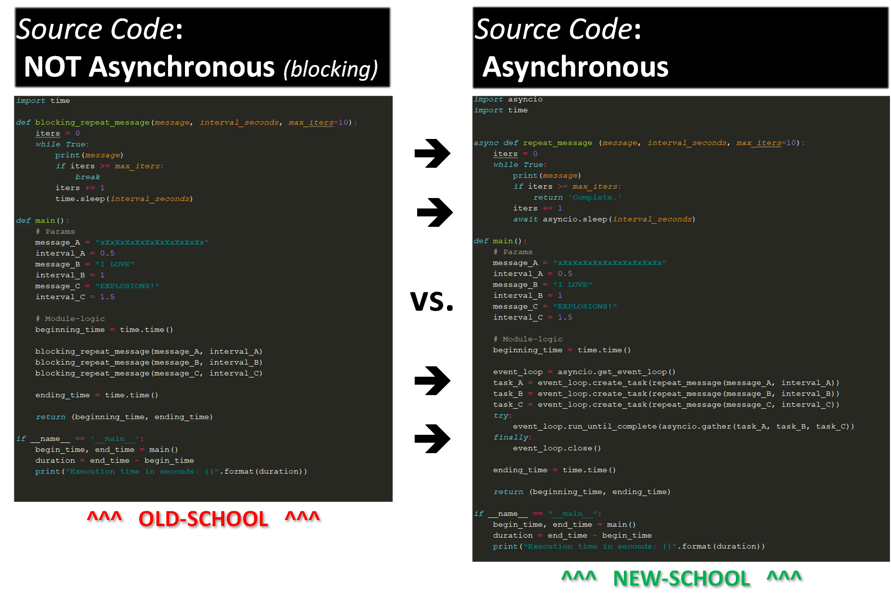
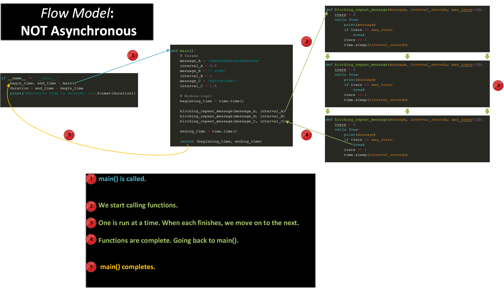
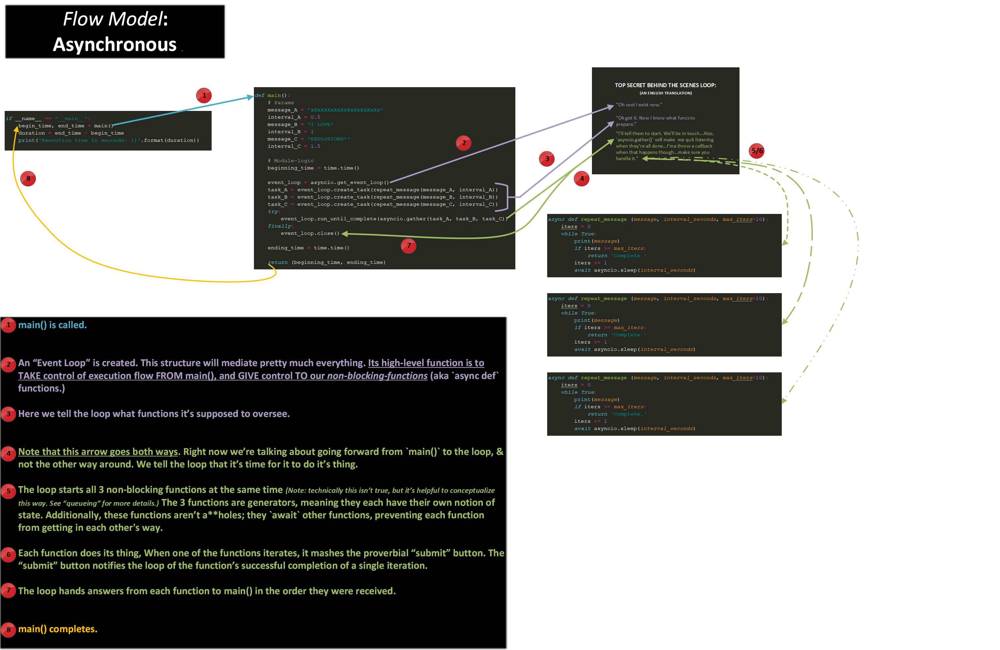

# Quotes! Quotes!:
#### Don't take my word for it that `asyncio` is awesome; listen to what this dead greek philosopher has to say:  
<br>

>## *"`asyncio` is friggin' dope b/c it bypasses the GIL entirely...*<br> *...just trust me. I'm a Philosopher."*
>~***Herodotus, BC 128***


#### As you can plainly see, the little-known `asyncio`-teachings of Herodotus had a significant influence on the ancient Greek community:

>## *"My boy Herodotus suggested I use `asyncio` & it changed my life.*<br><br> *It's like...instead of main() calling functions, the functions call main(). Totally blew my mind man, TOTALLY blew my mind..."*
>~***A Homeboy of Herodotus, BC 256***


# Diagrams Galore!
***Note:*** Feel free to skip to the next section _'How to Use This Subpackage:'_ if these diagrams aren't doin' it for ya.
## Let's compare...



## Grampa's flow:


## Grandson's flow:
#### _(srsly try to read this before skipping it.)_



<br>

# How to Use This Subpackage:

## Step 1 --- Prepare to be mildly excited.

In this subpackage you'll find 2 `.py` files: `grandpas_code.py` & `grandsons_code.py`.  
Both process the same amount of data; they use the same variables & ***each function-call takes the same amount of time to execute.***  

However looking at the run-time output given by each module, you'll notice `grandson`'s module takes half the time overall.  

How this works is confusing...that's sort of the reason I've put together this repo.   

This subpackage won't explain much about how that works, ***but don't worry yet.*** We'll cover the "why?" in the other subpackage `async_examples/`.

## Step 2 --- Clone the repo if you haven't already:
```shell
~$ git clone https://github.com/rtruxal/asyncio_explained.git
~$ cd ./asyncio_explained/comparisons/
```
## Step 3 --- Run ze modules!
```shell
~$ python3 ./grampas_code.py
RUNNING MODULE: grandpas_code.py...

Grandpa doesn't know anything about asynchronous execution. 

Here's the output of his function:
xXxXxXxXxXxXxXxXxXxXx
xXxXxXxXxXxXxXxXxXxXx
xXxXxXxXxXxXxXxXxXxXx
xXxXxXxXxXxXxXxXxXxXx
xXxXxXxXxXxXxXxXxXxXx
xXxXxXxXxXxXxXxXxXxXx
xXxXxXxXxXxXxXxXxXxXx
xXxXxXxXxXxXxXxXxXxXx
xXxXxXxXxXxXxXxXxXxXx
xXxXxXxXxXxXxXxXxXxXx
xXxXxXxXxXxXxXxXxXxXx
I LOVE
I LOVE
I LOVE
I LOVE
I LOVE
I LOVE
I LOVE
I LOVE
I LOVE
I LOVE
I LOVE
EXPLOSIONS!
EXPLOSIONS!
EXPLOSIONS!
EXPLOSIONS!
EXPLOSIONS!
EXPLOSIONS!
EXPLOSIONS!
EXPLOSIONS!
EXPLOSIONS!
EXPLOSIONS!
EXPLOSIONS!

Begun: Wed Aug  2 13:50:29 2017
Ended: Wed Aug  2 13:50:59 2017
DURATION: 30.01106548309326 seconds
```
#### 30 seconds! Not bad considering that's *exactly* how long it's supposed to take.
```shell
~$ python3 grandsons_code.py
RUNNING MODULE: grandsons_code.py

Grandson is a follower of the philosopher Herodotus & has mastered asynchronous execution.

Here's the output of his function:
xXxXxXxXxXxXxXxXxXxXx
I LOVE
EXPLOSIONS!
xXxXxXxXxXxXxXxXxXxXx
I LOVE
xXxXxXxXxXxXxXxXxXxXx
EXPLOSIONS!
xXxXxXxXxXxXxXxXxXxXx
I LOVE
xXxXxXxXxXxXxXxXxXxXx
xXxXxXxXxXxXxXxXxXxXx
I LOVE
EXPLOSIONS!
xXxXxXxXxXxXxXxXxXxXx
xXxXxXxXxXxXxXxXxXxXx
I LOVE
xXxXxXxXxXxXxXxXxXxXx
EXPLOSIONS!
xXxXxXxXxXxXxXxXxXxXx
I LOVE
xXxXxXxXxXxXxXxXxXxXx
EXPLOSIONS!
I LOVE
I LOVE
EXPLOSIONS!
I LOVE
EXPLOSIONS!
I LOVE
I LOVE
EXPLOSIONS!
EXPLOSIONS!
EXPLOSIONS!
EXPLOSIONS!

Begun: Wed Aug  2 13:57:49 2017
Ended: Wed Aug  2 13:58:04 2017
DURATION: 15.024974584579468 seconds
```
#### 15 seconds...MAGIC-SPLOSIONS!!!


## Step 4 --- Open the hood & read the code.
You may not (slash-probably don't if you're here...) understand `grandsons_code.py`.  

Don't worry about that yet. S'all good.

<br>

## Step 5 --- Now go back to `asyncio_explained/README.md and follow the next instructions.`